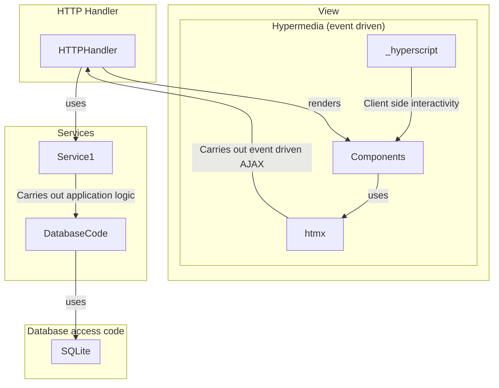

# Architecture

## **Figure 1:** Application Architecture

This architecture follows a typical "onion model" closely.
> ... where each layer doesn't know about the layer above it, and each layer is responsible for a specific thing.
>> [Application Architecture from templ.guide](https://templ.guide/project-structure/project-structure/#application-architecture)

