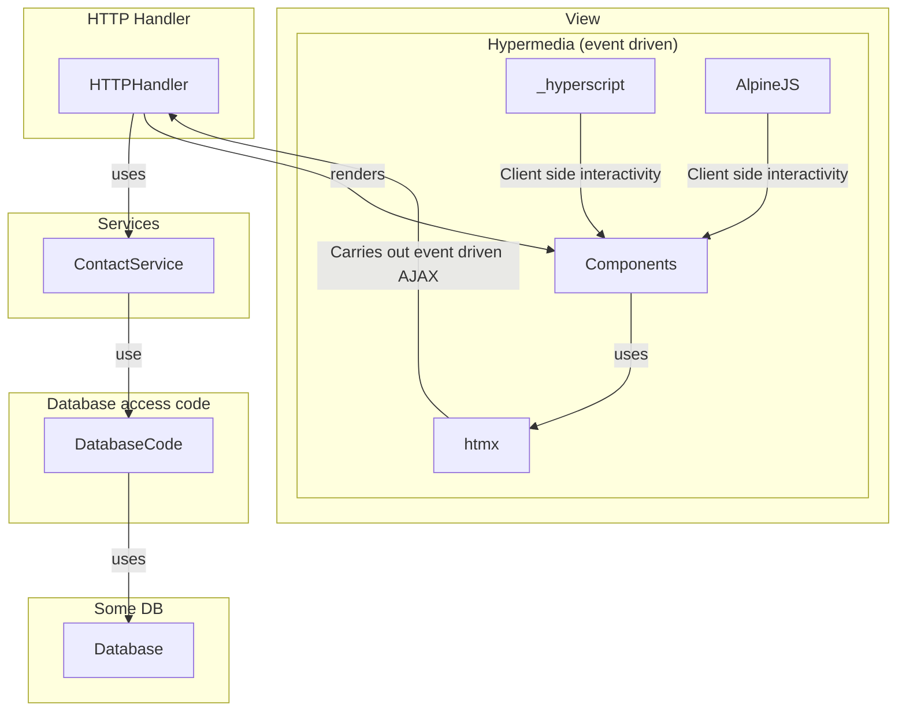

# Architecture

- [Architecture](#architecture)
  - [The Problem: 4 Steps](#the-problem-4-steps)
    - [Purpose](#purpose)
    - [Function](#function)
    - [Usage](#usage)
    - [Implementation/Form](#implementationform)
  - [**Figure 1:** Application Architecture](#figure-1-application-architecture)

## The Problem: 4 Steps

### Purpose

- Synchronize the presence of users in a gathering for a live event.
- Similar to an electoral ballot vote count.

### Function

- Editable by a limited number of people (admins).

### Usage

- CRUD operations for user entries.
- Mark users as inactive if they leave, otherwise mark them as active.

### Implementation/Form

- Server holds an in-memory repository (data of users).
- Frontend is an interface to interact with the server in an event-driven fashion.

---

## **Figure 1:** Application Architecture

This architecture closely follows the "onion model" principle,
> ... where each layer doesn't know about the layer above it, and each layer is responsible for a specific thing.
>> [Application Architecture from templ.guide](https://templ.guide/project-structure/project-structure/#application-architecture)

